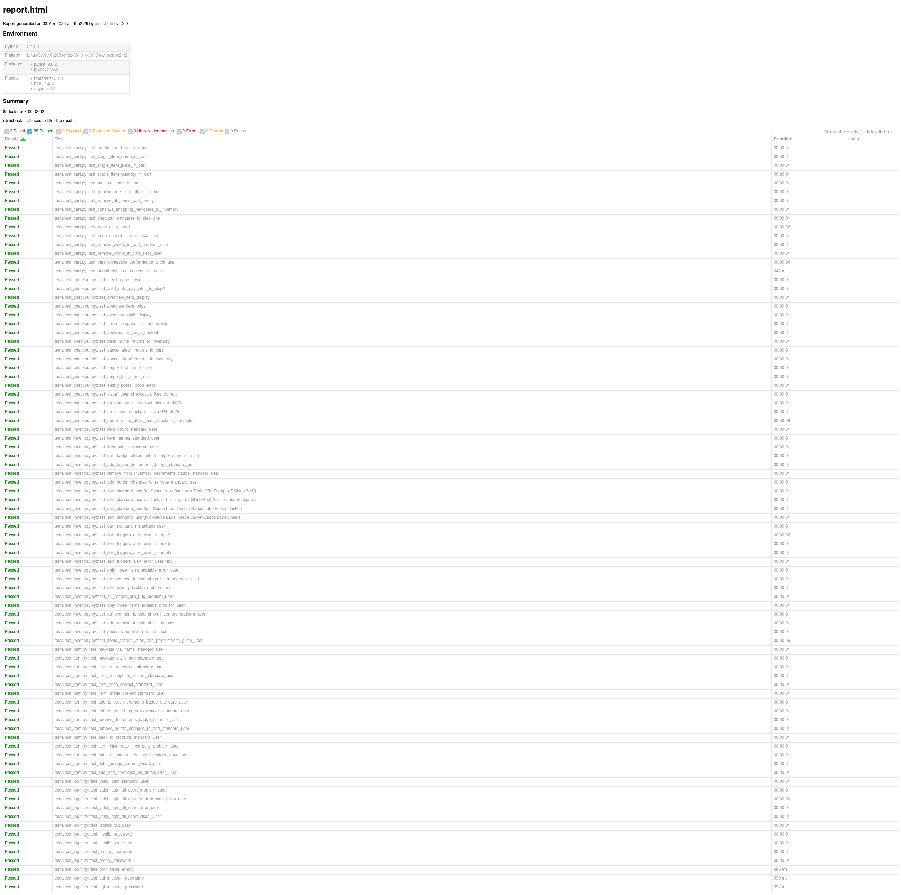

# Saucedemo QA Project

[](https://github.com/Terpacey/saucedemo-qa/actions/workflows/pytest.yml)
[](https://www.python.org/downloads/release/python-3130/)

## What this demonstrates

End-to-end QA coverage of [SauceDemo](https://www.saucedemo.com), an intentionally buggy e-commerce demo site. The project covers:

- **Test planning** — scope, strategy, entry/exit criteria documented in `test_plan.md`
- **Manual test documentation** — 92 test cases across login, inventory, item detail, cart, and checkout
- **Defect reporting** — 25 structured defect reports with severity, priority, reproduction steps, and screenshots
- **Automation** — 85 Selenium tests using the Page Object Model, organised by user type and marker
- **CI/CD** — GitHub Actions pipeline running ruff linting and the full test suite headless on every push

---

## Project Structure

```
qa-portfolio-web/
├── test_plan.md                  # Test plan
├── rtm.md                        # Requirements Traceability Matrix
├── manual_testing/               # Manual test cases (Markdown)
├── defect_reports/               # Defect reports by feature area
└── automation/
    ├── pages/                    # Page Object Model classes
    ├── tests/                    # pytest test files
    ├── conftest.py               # Fixtures and hooks (screenshot on failure)
    ├── config.py                 # Browser and delay configuration
    ├── pytest.ini                # Marker definitions and report config
    └── reports/                  # Auto-generated HTML report (git-ignored)
```

---

## How to Run Automation Tests

```bash
pip install -r automation/requirements.txt
cd automation
pytest
```

For a faster run with near-zero delays:

```bash
# Linux / macOS
FAST_MODE=true pytest

# Windows (PowerShell)
$env:FAST_MODE = "true"; pytest
```

An HTML report is generated at `automation/reports/report.html` and opens in your browser automatically when the run completes. Screenshots of any failing tests are embedded directly in the report.

**Run a subset with markers**

```bash
pytest -m smoke             # fast critical-path tests only
pytest -m standard_user     # baseline user tests
pytest -m defect            # tests that assert known-broken behaviour
pytest -m "error_user"      # tests for a specific user type
```

Available markers: `smoke`, `standard_user`, `problem_user`, `error_user`, `visual_user`, `performance_glitch_user`, `defect`.

**Changing the browser**

Pass a `BROWSER` environment variable — no file editing required:

```bash
# Linux / macOS
BROWSER=firefox pytest
BROWSER=edge pytest

# Windows (PowerShell)
$env:BROWSER = "firefox"; pytest
```

Supported values: `chrome` (default), `firefox`, `edge`. Firefox requires [geckodriver](https://github.com/mozilla/geckodriver/releases) on PATH; Edge requires msedgedriver. These are driver executables that act as the bridge between Selenium and the browser, the same role ChromeDriver plays for Chrome.

To change the default permanently, edit `BROWSER` in `automation/config.py`. Linux-specific Chrome flags are applied automatically and only when Chrome is selected.

**Changing run speed**

All delay constants are controlled by `FAST_MODE`. Pass it as an environment variable:

```bash
# Linux / macOS
FAST_MODE=true pytest    # near-zero delays (~2 minutes)

# Windows (PowerShell)
$env:FAST_MODE = "true"; pytest
```

`FAST_MODE` defaults to `false` locally and is set automatically to `true` in CI. To change the local default, edit `FAST_MODE` in `automation/config.py`.

Note: `DELAY_SORT` in `InventoryPage` keeps a minimum of 0.3 s even when `FAST_MODE` is on. Sorting triggers a full DOM re-render; removing all delay here produces stale-element failures.

---

## Report


